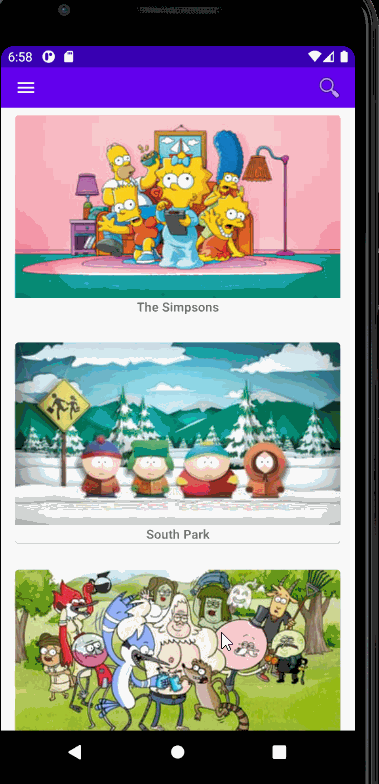

# **Cartoon-Locator**

**Cartoon-Locator** is a simple android app that allows users to find where they can watch new and classic cartoons originating from the United States.
Completed Functionality:

- [x] User is welcomed to a list of the most popular cartoons in the US in decreasing popularity.
- [ ] Option to view which shows initially aired in different ranges of years.
- [ ] Shows can be clicked and a detailed view of the show will be presented with options for where the show can be watched.
- [ ] Users can search for a specific show.
- [ ] Snap to the first item in RecyclerView lists.
- [ ] Add transitions.
- [ ] Functionality to add more pages of shows when scrolling to the end of the RecyclerView.

## Video Walkthrough

Here's a walkthrough:

GIF created with [LiceCap](http://www.cockos.com/licecap/).
